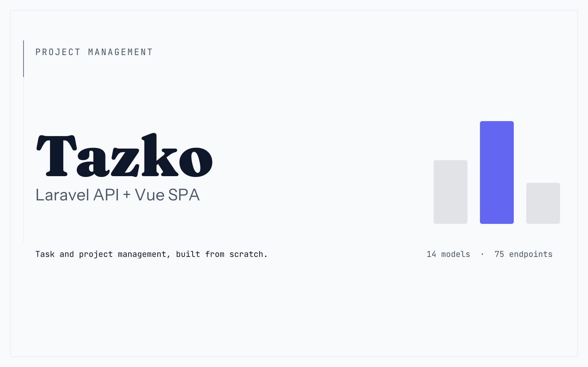

# Tazko — API

   

A task and project management API — the Laravel half of Tazko. The front end is a separate Vue
single-page app: [Tazko-Frontend](https://github.com/Rupashdas/Tazko-Frontend).

Tazko is in build. What's below describes what exists in this repository today, not a plan.

## What's here

- **14 models** — users, projects, tasks, subtasks, comments (polymorphic, so the same thread
  code serves tasks and projects), labels, attachments, invitations, roles and capabilities among
  them.
- **75 API endpoints** across `routes/api.php`, authenticated with
  [Sanctum](https://laravel.com/docs/sanctum).
- **Capability-based permissions**, not hard-coded roles. 80 capabilities across 14 modules
  (`CapabilityRegistry`), seeded into the database rather than checked against a fixed enum, so a
  role is a named set of capabilities rather than a switch statement someone has to extend.

## Requirements

| | |
|---|---|
| PHP | 8.2 or newer |
| Composer | 2.x |
| Node | for the asset build — see `package.json` |
| MySQL | any recent version |

## Setup

```bash
composer install
cp .env.example .env
php artisan key:generate
# set DB_* in .env, then:
php artisan migrate --seed
npm install && npm run build
```

Or the one-liner version of the same steps:

```bash
composer run setup
```

`php artisan serve` starts the API. The seeders in `database/seeders/` create the capability and
role tables — `RoleSeeder` and `CapabilitySeeder` need to run before any real use, which
`--seed` above already covers.

## Testing

```bash
composer test
```

Runs `php artisan test` against the suite in `tests/`.

## Architecture notes

- **Permissions are composed, not inherited.** A role holds a set of capability names; nothing in
  the authorization layer hard-codes what an "admin" can do. The point of that distinction is on
  the case study, not repeated here: [devrupash.com/projects/tazko](https://devrupash.com/projects/tazko).
- **Comments are polymorphic.** One `comments` table, one thread implementation, used by both
  tasks and projects rather than duplicated per parent type.
- Decoupled from the front end on purpose — this API has no opinion about what consumes it, and
  [Tazko-Frontend](https://github.com/Rupashdas/Tazko-Frontend) is only the first thing that does.

## License

MIT.
